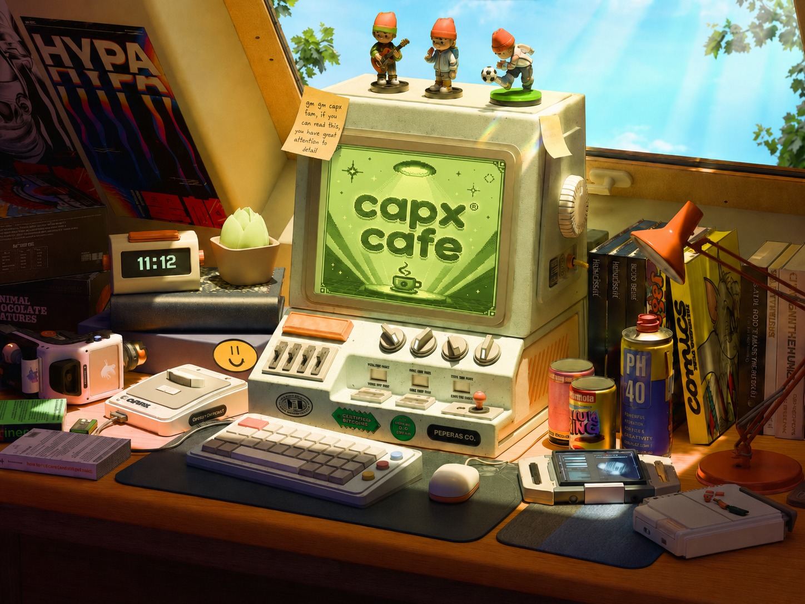
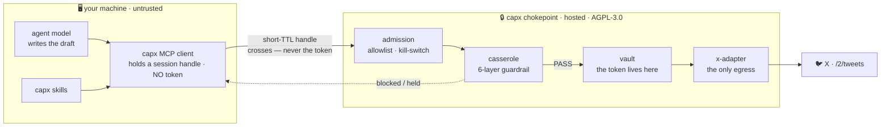
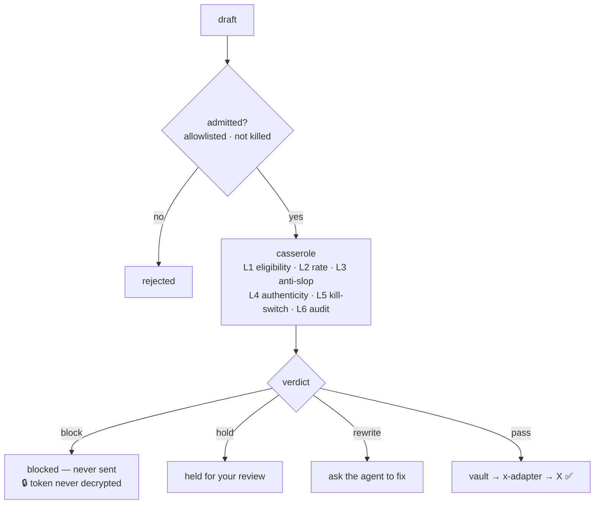
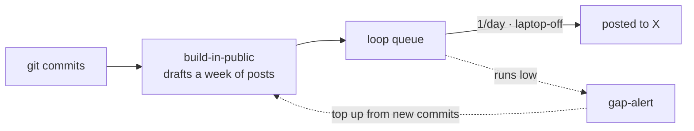

<div align="center">



# capx café

### The safe way to let your AI run your X.

**One MCP server. Your X token never touches the agent — and every post clears an enforced guardrail before it ships.**


<br>


*The guardrail, live — every verdict above is produced by the real chokepoint code (`pnpm demo` replays it).*

</div>

---

> **capx café is an agent-native X poster that installs as one MCP server into any coding agent** (Claude Code /
> Cursor / Codex / Windsurf). A whitelisted user connects their X account once; after that they create /
> schedule / post from inside their agent session. The whole product rests on one **security thesis**: the X
> token, the guardrail (**casserole**), and the send are **one inseparable server-side unit** — the agent on
> your laptop only ever holds a short-TTL session handle, never the token. That's why it structurally can't be
> prompt-injected into tweeting a scam. **"The AI writes; casserole decides what ships."**

---

## Why it's different

Every other "let your AI post" tool has the same flaw: to let an agent post, you paste your X token into a
plaintext config **right next to an autonomous agent that reads untrusted web pages, issues, and code.** One
prompt-injection and your account tweets a scam. **capx café is the only one that structurally can't be.**

- 🔒 **Your X token never touches your machine.** OAuth completes on capx's hosted callback; the token lives
  **encrypted in a server-side vault.** Your agent holds only a short-TTL, revocable session handle.
- 🛡️ **casserole** — a *deterministic (non-AI)* six-layer guardrail — runs **server-side at the only door to X**
  and checks **every** post. A blocked post never even decrypts your token (proven by an adversarial test suite).
- 🔗 **The token, the guard, and the send are one unit.** Skip the plugin and call the server directly — you
  still hit the guard. The client's checks are cosmetic; the server's are load-bearing.
- ✍️ **capx generates nothing.** *Your* agent's model writes; capx ships what clears the guard.

→ Full threat model, architecture & the "what we can/can't see" table: **[docs/SECURITY.md](docs/SECURITY.md)**

## How it works



The token, the guardrail, and the send live together behind a trust boundary; your agent can only *ask*.

## The guardrail: casserole

Six deterministic layers on every post. Worst result wins — **pass / rewrite / hold / block** — and a blocked
post never even decrypts the token.



## 60-second quickstart

```bash
npx -y capx-cafe          # runs the MCP server — add it to your agent's MCP config
```

Then, inside your agent:

```text
"connect my X account"              → opens a browser once; the token stays on the server
"post: shipping the thing today"    → clears casserole, or tells you exactly why not
"turn my last week of commits into a build-in-public thread"   → drafts + queues it
```

Set `CAPX_EMAIL` (your whitelisted email) and, for the BYO lane, `X_CLIENT_ID` (your own X app) in
`~/.capx/config.json` or your agent's MCP env. A guided setup page hands you the exact callback URL to paste.

### Install matrix

| Agent | How |
|---|---|
| **Claude Code** | `/plugin marketplace add vb-tyagi/capx-cafe` → `/plugin install capx-cafe` (MCP + slash commands + skills) |
| **Cursor** | add to `.cursor/mcp.json`; skill rules in `plugins/capx-cafe/adapters/cursor/` |
| **Codex** | add to your MCP config; prompt pack in `plugins/capx-cafe/adapters/codex/` |
| **Windsurf** | add to MCP config; workflows in `plugins/capx-cafe/adapters/windsurf/` |
| **Any MCP agent** | point it at `npx -y capx-cafe` |

## What your agent can do

| Tool | What it does |
|---|---|
| `connect_x` | One-time browser OAuth — the token lands in the server vault, never on your machine |
| `post_now` | Post now (clears casserole first). Supports **reply-chains** and **media** |
| `preview` | **Dry-run** a draft through the guardrail without sending — pass / hold / block + why |
| `audit` | The durable record of what capx posted or attempted on your behalf, and its state |
| `create_loop` · `list_loops` · … | **Scheduled posting** — a queue you wrote, sent on a schedule, **laptop-off** |
| `upload_media` | Stream a local image/video to X and attach it (media you made with your own tools) |
| `whoami` | The connected account + its status |

## Skills — your work becomes your content

capx lives inside a *coding* agent, so it has what no social scheduler does: your **repo, commits, PRs,
releases.** Skills turn that into posts — automatically, and always through the guardrail.



**The self-refilling content engine:** you code → commits accrue → the loop drains as it posts → gap-alert
tops it up from the *new* commits. Your normal work *is* the pipeline.

- 🏆 **build-in-public** · **ship-note** · **changelog-thread** · **repurpose** (blog/README → thread) · **launch-thread** · **til** · **fix-note**
- **voice-match** (sound like you) · **draft-review** (lint against the guard) · **thread-builder** · **hook-rewrite**
- **best-time** · **cadence-planner** · **gap-alert** · **audit-trail** · **connection-health** · **quickstart** · **self-host-guide**
- **Media directors** — `image-director`, `video-director`, `prompt-engine`, `model-guide`: capx runs no models;
  it guides *your* image/video tools (higgsfield, fal, kling, …) and uploads the result. casserole guards your
  **caption**; you own the media.

*One canonical `SKILL.md` per skill, generated for all four agents. capx never writes the content — it makes
good content easy and stops bad content regardless of which skill produced it.*

## Two lanes

- **BYO** — bring your own X developer app. You're X's customer and **pay X directly** — since Feb 2026
  that means pre-loading credits (no free X tier for new apps) at ~$0.015/post, **$0.20 if the post
  contains a link**. Free on capx's side; heavy users can self-host the identical image.
- **capx-app** (creator lane) — post through capx's X app, no developer account needed. Ships as a
  **paid beta**: `Short $5` / `Tall $15` / `Grande $35` monthly tiers + top-up packs, quotas enforced
  server-side at the gate. Full sheet + the math: **[docs/ECONOMICS.md](docs/ECONOMICS.md)** · policy
  posture: [docs/X-COMPLIANCE.md](docs/X-COMPLIANCE.md).

## Self-host

The chokepoint is open source (AGPL-3.0). Run the **identical image** with your own X app, keys, database, and
domain — `CAPX_DEPLOY_MODE=self-host`, zero telemetry to capx. See the `self-host-guide` skill and
[docs/HANDOFF.md](docs/HANDOFF.md).

## Licensing

**MIT** for the client and everything it bundles (`apps/capx-mcp`, `core`, `config`, `platform-client`) plus
skills & docs. **AGPL-3.0** for the server half (the chokepoint + `casserole`/`captain`/`counter`/`canteen`/
`chef`). Full map: **[LICENSING.md](LICENSING.md)**.

## Status

**Private alpha, whitelist-only.** The first real post shipped **2026-07-19** — guardrail-cleared, token never
on the machine. Not yet open for public signups.

## Dev

Node ≥ 22.6 (TypeScript runs natively via `--experimental-strip-types` — no build step). `pnpm run verify` =
unit tests across packages / services / apps + `tsc`. Contributions accepted under the project CLA.

<div align="center"><sub>capx café · <a href="docs/SECURITY.md">security</a> · <a href="docs/HANDOFF.md">architecture</a> · <a href="LICENSING.md">license</a></sub></div>
